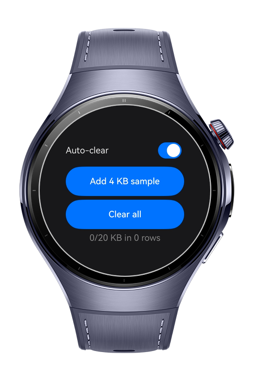
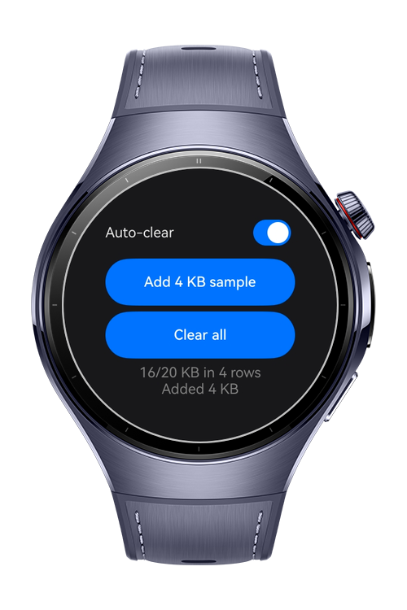
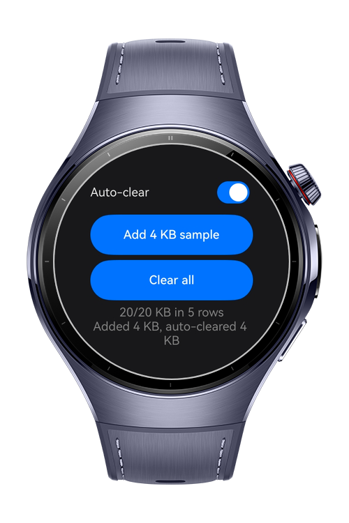

> **Note:** To access all shared projects, get information about environment setup, and view other guides, please visit [Explore-In-HMOS-Wearable Index](https://github.com/Explore-In-HMOS-Wearable/hmos-index).

# How to Build Auto Clear Storage Manager
This sample showcases how to implement an auto-clear logic for a database. It will automatically clear the oldest data as the set limit is reached.

# Preview
<div>
  
  
  
</div>

# Use Cases
- Applications that want to limit how much storage the app uses.
- Applications that need a way to free up space automatically.

# Tech Stack
- **Language:** ArkTS
- **Framework**: HarmonyOS SDK 6.0.0(20)
- **Tools** DevEco Studio 6.1.1 Release
- **Libraries**:
  - **ArkData Kit:** `relationalStore` used for the demo's sandbox database.
  - **Ability Kit:** `common` used to access the necessary context.

# Directory Structure
```
entry/src/main/
├── ets/
│   ├── pages/
│   │   └── Index.ets             # Main UI to showcase the mechanism in action
│   └── storage/
│       ├── SampleDatabase.ets    # Sample database structure for the demo project
│       └── StorageManager.ets    # Storage manager that implements auto-clear logic
├── module.json5
```

# Constraints and Restrictions
## Supported Devices
- Huawei Watch 5/6
- Huawei Watch Kids X1

# LICENSE
**How to Build Auto Clear Storage Manager** is distributed under the terms of the **MIT License**.
See the [LICENSE](/LICENSE) for more information.
